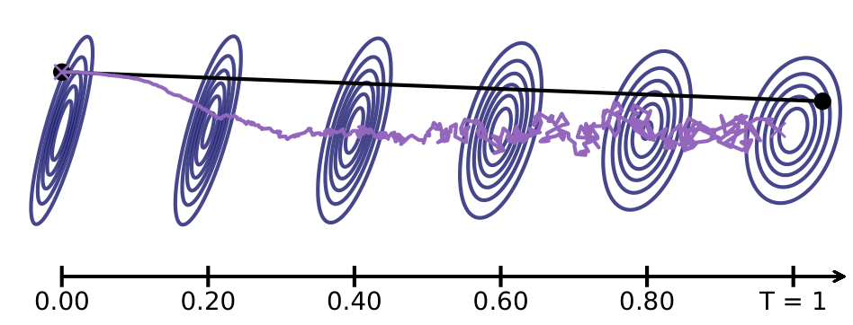

## Background

We keep the same equation numbering as in the paper.  
We study the continuous formulation of diffusion models, focusing on the Variance Preserving (VP-SDE) framework [[Song et al., 2021]](#Song). The forward process is:

 \begin{equation}
 \label{eq:sde_forward}
 	d\boldsymbol{x}_t  =- \beta_t \boldsymbol{x}_t dt + \sqrt{2\beta_t}d\boldsymbol{w}_t, \quad 0 \leq t \leq T,   \boldsymbol{x}_0 \sim p\_{\text{data}}. \tag{1}
 \end{equation}

This degrades the data progressively. Denoting by $p_t$ the marginal distribution of $ \boldsymbol{x}_t$, we have $p_T$ close to $\mathcal{N}(0, I)$ if $\beta_t$ is properly chosen.  
Theoretically, the reverse-time process [[Pardoux, 1986]](#Pardoux) is governed by the backward SDE:


\begin{equation}
\label{eq:sde_backward}
 d{\boldsymbol{y}}\_t = \beta_{T-t}[{\boldsymbol{y}}\_t + 2  \nabla \log  p_{T-t}({\boldsymbol{y}}\_t)]dt + \sqrt{2\beta_{T-t}}d{\boldsymbol{w}}\_t,
    \quad 0 \leq t < T, {\boldsymbol{y}}\_0 \sim p_T \tag{2}
\end{equation}

Or equivalently, the associated probability flow ODE:

\begin{equation}
 \label{eq:flow_reverse_ode}
 	d{\boldsymbol{y}}\_t = \beta_{T-t}\left[{\boldsymbol{y}}\_t+ \nabla\log p_{T-t}({\boldsymbol{y}}\_t)\right]dt, \quad 0 \leq t < T, {\boldsymbol{y}}\_0 \sim p_T. \tag{5}
 \end{equation}

We illustrate this idea below: assuming that  $p\_{\text{data}}$ is Gaussian (left of the figure), the forward process evolves from left to right. The <span style="color: rgb(142,105,185);">backward SDE (purple)</span> and the probability flow ODE (black) reverse this evolution, with overlapping Gaussian ellipses in blue at each time step.



## Error Types in Diffusion Models

We identify four distinct sources of error:

- **Initialization error**
- **Truncation error**
- **Discretization error**
- **Score approximation error**

### Initialization Error

Occurs when the backward SDE or flow ODE is initialized with $\mathcal{N}(0,I)$ instead of the true $p_T$. This mismatch arises because $p_T$ is unknown in general. Although the forward process converges to $\mathcal{N}(0, I$ asymptotically, in practice we must use a finite $T$. This mismatch causes divergence between the SDE and ODE reverse marginals.


---

### Truncation Error

This error results from stopping the reverse process at some small $\varepsilon > 0$ instead of time 0. It's necessary when the data distribution lacks a density, e.g. if it's supported on a manifold, making $\nabla \log p_t$ undefined at $t=0$.


---

### Discretization Error

Discretizing the backward SDE or flow ODE is required for numerical simulation. The choice of discretization scheme (Euler, Heun, etc.) directly impacts the quality of the generated samples.


---

### Score Approximation Error

In practice, the score function $\nabla \log p_t$ is unknown and approximated by a neural network $s_\theta$. This introduces a model approximation error. The success of diffusion models hinges on the quality of this learned score function.

---

## Analysis Under Gaussian Assumption

To precisely analyze these errors, we focus on a tractable case:

**Assumption (Gaussian assumption):**  $\quad  p\_{\text{data}} = \mathcal{N}(0, \boldsymbol{\Sigma}) $

This allows closed-form derivations. The covariance matrix $\boldsymbol{\Sigma}$ may be non-invertible, in which case the data lies on a manifold.

The exact score is given by:

\begin{equation}
\nabla\_{\boldsymbol{x}} \log p_t(\boldsymbol{x}) = -\boldsymbol{\Sigma}\_t^{-1} \boldsymbol{x}
\end{equation}

where $ \boldsymbol{\Sigma}\_t = e^{-\int_0^t \beta_s ds} \boldsymbol{\Sigma} + (1 - e^{-\int_0^t \beta_s ds}) I $.

**Note:** When $\boldsymbol{\Sigma} $ is singular, the score is undefined at $t = 0$, explaining the necessity of truncation.

In this Gaussian setting, we:

- Derive closed-form solutions for the backward SDE (**Proposition 2**)
- Solve the probability flow ODE exactly (**Proposition 3**)
- Compute exact Wasserstein-2 errors from initialization, truncation, and discretization (**Section 4**)
- Empirically study the score approximation error (**Section 5**)

---

## Key Takeaways

- With only initialization error, the ODE sampler is more accurate than the SDE sampler (**Proposition 4**)
- Adding truncation and discretization errors, Heun's method applied to the ODE yields the best performance (**Figure 1**)
- Score approximation is the most critical error in practice, and the SDE sampler is more robust to this noise

For full derivations and results, see the paper.

<details> 

<summary>Bibtex</summary>

```
@inproceedings{Pierret_Galerne_diffusion_models_Gaussian_exact_solutions_errors_ICML2025,
title={Diffusion models for Gaussian distributions: Exact solutions and Wasserstein errors},
author={Emile Pierret and Bruno Galerne},
booktitle={Forty-second International Conference on Machine Learning},
year={2025},
}
```

</details>


## References

 <p id="Song"> <span style="color: blue;">[Song et al., 2021]</span>  Yang Song, Jascha Sohl-Dickstein, Diederik P Kingma, Abhishek Kumar, Stefano Ermon, & Ben Poole (2021). Score-Based Generative Modeling through Stochastic Differential Equations. In International Conference on Learning Representations. </p>

<p id="Pardoux"> <span style="color: blue;">[Pardoux, 1986]</span> Pardoux, Étienne. Grossissement d'une filtration et retournement du temps d'une diffusion. Séminaire de probabilités, Tome 20 (1986), pp. 48-55. </p>

